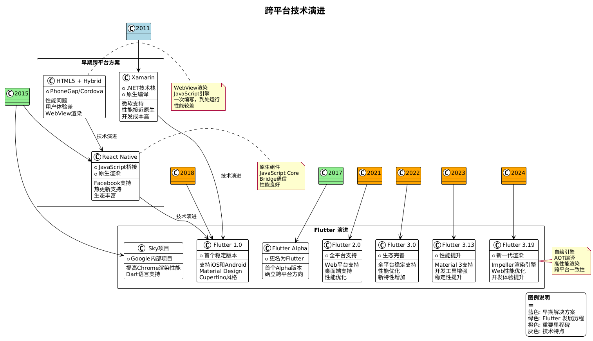
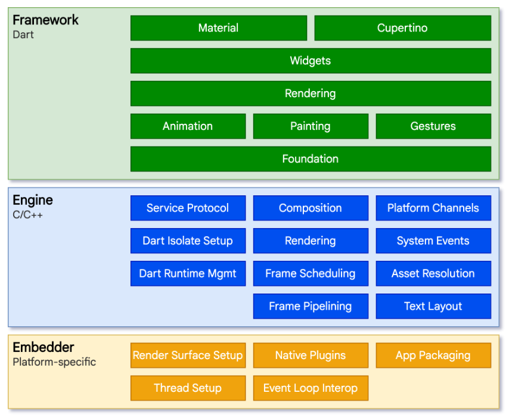
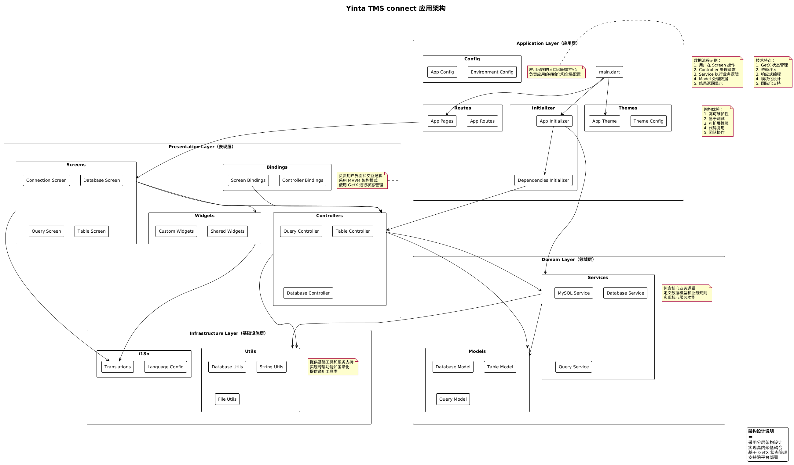

# Flutter 跨平台开发实践
[TOC]


## 基于 Yinta TMS 项目的最佳实践分享

### 目录
1. Flutter 简介与发展历程
2. 开发环境搭建
3. Dart 语言基础
4. Flutter 核心原理
5. Flutter 基础组件
6. Yinta TMS 项目实战
7. 性能优化与最佳实践
8. Flutter 未来展望

### 1. Flutter 简介与发展历程

#### 1.1 跨平台技术演进


1. **早期解决方案**
   - HTML5 + Hybrid
     - PhoneGap/Cordova
     - 性能问题
     - 用户体验差
   - React Native (2015)
     - JavaScript 桥接
     - 原生渲染
     - Facebook 支持
   - Xamarin (2011)
     - .NET 技术栈
     - 原生编译
     - 微软支持

2. **Flutter 的诞生**
   - 2015年：Sky 项目启动
     - Google 内部代号为 "Sky"
     - 最初目标是提高 Chrome 渲染性能
   - 2017年：更名为 Flutter
     - 首个 Alpha 版本发布
     - 确立跨平台开发方向
   - 2018年：Flutter 1.0 发布
     - 支持 iOS 和 Android 开发
     - Material Design 和 Cupertino 风格组件
   - 2021年：Flutter 2.0 发布
     - 正式支持 Web 平台
     - 增加桌面端支持
   - 2022年：Flutter 3.0 发布
     - 全平台支持（移动、Web、桌面）
     - 性能优化和新特性
   - 2023年：Flutter 3.13 发布
     - 性能进一步优化
     - Material 3 支持完善
     - 开发工具增强
   - 2024年：Flutter 3.19 发布
     - 新增 Impeller 渲染引擎
     - 改进 Web 平台性能
     - 增强跨平台开发体验

#### 1.2 主流跨平台框架对比

1. **技术架构对比**

| 特性 | Flutter | React Native | uni-app | HarmonyOS | Xamarin |
|------|---------|--------------|---------|-----------|---------|
| 开发语言 | Dart | JavaScript/TypeScript | Vue/JavaScript | ArkTS/JavaScript | C# |
| 渲染引擎 | 自绘引擎(Skia) | 原生组件 | 小程序/原生/WebView | 方舟渲染引擎 | 原生组件 |
| 性能表现 | 接近原生 | 良好 | 良好 | 接近原生 | 接近原生 |
| 热重载 | 支持 | 支持 | 支持 | 支持 | 部分支持 |
| 跨平台范围 | 全平台 | 移动+Web | 全平台+小程序 | 鸿蒙+安卓+Web | 移动+桌面 |
| 学习曲线 | 中等 | 较低 | 较低 | 中等 | 较高 |
| 社区活跃度 | 非常活跃 | 非常活跃 | 活跃(国内) | 快速增长(国内) | 活跃 |
| 生态系统 | 快速成长 | 成熟 | 成熟(国内) | 发展中 | 成熟 |

2. **开发效率对比**

| 维度 | Flutter | React Native | uni-app | HarmonyOS | Xamarin |
|------|---------|--------------|---------|-----------|---------|
| 环境搭建 | 简单 | 中等 | 简单 | 中等 | 复杂 |
| 开发速度 | 快 | 快 | 很快 | 中等 | 中等 |
| 调试便利性 | 优秀 | 良好 | 优秀 | 良好 | 良好 |
| 打包发布 | 简单 | 中等 | 简单 | 中等 | 复杂 |
| 代码复用率 | 95%+ | 90%+ | 98%+ | 85%+ | 75%+ |
| 小程序支持 | 不支持 | 不支持 | 原生支持 | 不支持 | 不支持 |
| 上架难度 | 中等 | 中等 | 低 | 低(华为商店) | 中等 |

3. **性能对比**

| 指标 | Flutter | React Native | uni-app | HarmonyOS | Xamarin |
|------|---------|--------------|---------|-----------|---------|
| 启动时间 | 快 | 中等 | 中等 | 快 | 快 |
| 内存占用 | 中等 | 较高 | 较低 | 低 | 较低 |
| 渲染性能 | 60fps | 60fps* | 30-60fps | 60fps | 60fps |
| 动画流畅度 | 优秀 | 良好 | 良好 | 优秀 | 良好 |
| 大规模列表 | 优秀 | 良好 | 良好 | 优秀 | 良好 |
| 包体积 | 中等 | 较大 | 小 | 小 | 较大 |

*注：React Native 在复杂界面可能出现掉帧

4. **特色功能对比**

| 功能 | Flutter | React Native | uni-app | HarmonyOS | Xamarin |
|------|---------|--------------|---------|-----------|---------|
| 原生能力 | 优秀 | 良好 | 良好 | 优秀 | 优秀 |
| 自定义动画 | 优秀 | 良好 | 一般 | 优秀 | 良好 |
| 跨端一致性 | 优秀 | 良好 | 优秀 | 良好 | 良好 |
| 小程序生态 | 无 | 无 | 完整支持 | 部分支持 | 无 |
| 分包能力 | 支持 | 支持 | 完整支持 | 支持 | 支持 |
| 热更新 | 不支持* | 支持 | 支持 | 支持 | 不支持 |
| 国内生态 | 良好 | 良好 | 优秀 | 快速成长 | 一般 |

*注：Flutter 官方不支持热更新，但有第三方解决方案

5. **适用场景对比**

| 场景 | Flutter | React Native | uni-app | HarmonyOS | Xamarin |
|------|---------|--------------|---------|-----------|---------|
| 企业应用 | 优秀 | 良好 | 良好 | 良好 | 优秀 |
| 电商应用 | 良好 | 良好 | 优秀 | 良好 | 良好 |
| 游戏应用 | 一般 | 不适合 | 一般 | 良好 | 不适合 |
| 工具应用 | 优秀 | 良好 | 良好 | 优秀 | 良好 |
| 多端发布 | 优秀 | 良好 | 优秀 | 一般 | 良好 |
| 小程序 | 不适合 | 不适合 | 优秀 | 良好 | 不适合 |
| IoT设备 | 支持 | 不支持 | 不支持 | 优秀 | 不支持 |

6. **开发成本对比**

| 成本因素 | Flutter | React Native | uni-app | HarmonyOS | Xamarin |
|----------|---------|--------------|---------|-----------|---------|
| 开发人员成本 | 中等 | 低 | 低 | 中等 | 高 |
| 学习成本 | 中等 | 低 | 低 | 中等 | 高 |
| 维护成本 | 低 | 中等 | 低 | 中等 | 中等 |
| 测试成本 | 低 | 中等 | 低 | 中等 | 中等 |
| 发布成本 | 中等 | 中等 | 低 | 低 | 高 |

#### 1.3 为什么选择 Flutter？

1. **技术优势**
   - 自绘引擎
     - 跨平台一致性好
     - 无需桥接性能好
     - 自定义能力强
   - Dart 语言
     - 专为 UI 优化
     - JIT + AOT 双编译
     - 强类型安全
   - 开发体验
     - 毫秒级热重载
     - 丰富的开发工具
     - 完善的调试支持

2. **业务优势**
   - 开发效率
     - 单一代码库
     - 快速迭代
     - 测试成本低
   - 维护成本
     - 统一技术栈
     - 简化团队结构
     - 降低沟通成本
   - 用户体验
     - 原生性能
     - 一致的体验
     - 流畅的动画

3. **生态优势**
   - Google 支持
     - 持续投入
     - 技术创新
     - 长期维护
   - 社区活跃
     - 丰富的第三方包
     - 活跃的技术社区
     - 完善的学习资源
   - 企业认可
     - 大厂采用
     - 成功案例多
     - 人才市场旺盛

#### 1.4 Flutter 核心优势
1. **一套代码，多端运行**
   - 支持 iOS、Android、Web、Windows、macOS、Linux
   - 95% 以上的代码可以复用
   - 显著降低开发和维护成本

2. **高性能渲染引擎**
   - 自带 Skia 渲染引擎
   - 不依赖原生平台控件
   - 保证所有平台UI一致性
   - 60fps 流畅渲染

3. **热重载开发体验**
   - 毫秒级热重载
   - 保持应用状态
   - 提高开发效率
   - 快速迭代和调试

4. **丰富的组件库**
   - Material Design 组件
   - Cupertino（iOS风格）组件
   - 自定义组件支持
   - 丰富的第三方组件

#### 1.5 知名应用案例


1. **Google**
   - Google Pay - 支付应用
   - Google Ads - 广告管理
   - Google Classroom - 在线教育
   - Stadia - 云游戏平台（已停止运营）

2. **阿里巴巴**
   - 闲鱼 - 二手交易平台
   - 优酷 - 视频播放器
   - 飞猪 - 旅行预订
   - 盒马 - 新零售平台

3. **字节跳动**
   - 西瓜视频
   - 今日头条（部分功能）
   - 抖音（部分功能）

4. **腾讯**
   - 腾讯文档 - 在线办公
   - 微视 - 短视频平台
   - 腾讯广告

5. **其他知名应用**
   - BMW - 汽车控制应用
   - eBay Motors - 汽车交易
   - Nubank - 巴西最大数字银行
   - Grab - 东南亚最大打车平台
   - Philips Hue - 智能家居控制
   - Tencent NOW - 直播平台
   - Reflectly - 日记应用
   - Postmuse - 社交媒体编辑器
   - Topline - 音乐创作应用

6. **企业应用**
   - Alibaba Group - 内部工具
   - Google - 内部管理系统
   - 字节跳动 - 开发者平台
   - 美团 - 商家端应用

这些应用充分展示了 Flutter 在不同领域的应用能力：
- 社交媒体和短视频
- 电子商务和支付
- 企业管理系统
- 工具类应用
- 智能家居控制
- 音视频处理
- 在线教育
- 金融科技

### 2. 开发环境搭建

#### 2.1 环境要求
- Flutter SDK (3.24.3 或更高版本)
- Dart SDK (3.5.3 或更高版本)
- Android Studio / VS Code
- Android SDK (安卓开发)
- Xcode (iOS 开发，仅 macOS)

#### 2.2 开发工具
1. **IDE 配置**
   - Android Studio 配置
   - VS Code 插件安装
   - Flutter 和 Dart 插件

2. **环境变量设置**
   - Flutter SDK 路径
   - Android SDK 路径
   - Platform Tools 配置

3. **模拟器配置**
   - iOS 模拟器设置
   - Android 模拟器配置
   - Chrome 调试设置

### 3. Dart 语言基础

#### 3.1 变量与数据类型
1. **变量声明**
```dart
// 变量声明和初始化
var name = 'Bob'; // 类型推断
String title = 'Mr.'; // 显式类型
dynamic value = 42; // 动态类型
final age = 18; // 运行时常量
const pi = 3.14; // 编译时常量

// 空安全
String? nullableName; // 可空类型
String nonNullableName = 'John'; // 非空类型
late String delayedName; // 延迟初始化
```

2. **基本数据类型**
```dart
// 数值类型
int count = 3;
double price = 5.99;
num value = 42; // int 或 double

// 字符串
String name = 'Bob';
String message = "Hello $name"; // 字符串插值
String multiLine = '''
  This is a
  multi-line string
''';

// 布尔值
bool isValid = true;
bool isEmpty = false;

// 列表（数组）
List<int> numbers = [1, 2, 3];
var fruits = <String>['apple', 'banana'];

// 集合
Set<String> uniqueNames = {'John', 'Jane'};

// 映射
Map<String, dynamic> user = {
  'name': 'John',
  'age': 30,
  'isAdmin': true,
};
```

#### 3.2 流程控制
1. **条件语句**
```dart
// if-else
if (score >= 90) {
  print('优秀');
} else if (score >= 60) {
  print('及格');
} else {
  print('不及格');
}

// switch-case
switch (grade) {
  case 'A':
    print('优秀');
    break;
  case 'B':
    print('良好');
    break;
  default:
    print('其他');
}

// 条件表达式
String status = isOnline ? '在线' : '离线';
String? name = user?.name; // 空安全操作符
String display = name ?? 'Unknown'; // 空值合并操作符
```

2. **循环语句**
```dart
// for 循环
for (var i = 0; i < 5; i++) {
  print(i);
}

// for-in 循环
for (var item in items) {
  print(item);
}

// while 循环
while (condition) {
  // 循环体
}

// do-while 循环
do {
  // 循环体
} while (condition);

// forEach 方法
items.forEach((item) => print(item));
```

#### 3.3 函数
1. **函数定义与参数**
```dart
// 基本函数
int add(int a, int b) {
  return a + b;
}

// 箭头函数
int multiply(int a, int b) => a * b;

// 可选位置参数
String greet(String name, [String? title]) {
  return title != null ? '$title $name' : name;
}

// 命名参数
void createUser({
  required String name,
  int? age,
  bool isAdmin = false,
}) {
  // 函数体
}

// 函数作为参数
void processNumbers(List<int> numbers, int Function(int) processor) {
  for (var num in numbers) {
    print(processor(num));
  }
}
```

2. **异步函数**
```dart
// Future
Future<String> fetchUserData() async {
  try {
    final response = await http.get(url);
    return response.body;
  } catch (e) {
    return 'Error: $e';
  }
}

// Stream
Stream<int> countStream(int max) async* {
  for (int i = 1; i <= max; i++) {
    yield i;
    await Future.delayed(Duration(seconds: 1));
  }
}
```

#### 3.4 类与对象
1. **类的定义与构造函数**
```dart
class Person {
  // 属性
  final String name;
  int age;
  
  // 构造函数
  Person(this.name, this.age);
  
  // 命名构造函数
  Person.guest() : name = 'Guest', age = 18;
  
  // 工厂构造函数
  factory Person.fromJson(Map<String, dynamic> json) {
    return Person(
      json['name'] as String,
      json['age'] as int,
    );
  }
}
```

2. **继承与多态**
```dart
// 抽象类
abstract class Shape {
  double get area;
  void draw();
}

// 继承
class Circle extends Shape {
  final double radius;
  
  Circle(this.radius);
  
  @override
  double get area => 3.14 * radius * radius;
  
  @override
  void draw() {
    print('Drawing a circle');
  }
}

// 接口实现
class Rectangle implements Shape {
  final double width;
  final double height;
  
  Rectangle(this.width, this.height);
  
  @override
  double get area => width * height;
  
  @override
  void draw() {
    print('Drawing a rectangle');
  }
}
```

3. **Mixin 与扩展**
```dart
// Mixin
mixin Logger {
  void log(String message) {
    print('${DateTime.now()}: $message');
  }
}

class DatabaseService with Logger {
  void query() {
    log('Executing query...');
    // 查询逻辑
  }
}

// 扩展方法
extension DateTimeExtension on DateTime {
  String get formatted => '$year-$month-$day';
  
  bool isSameDay(DateTime other) {
    return year == other.year &&
           month == other.month &&
           day == other.day;
  }
}
```

#### 3.5 异常处理
```dart
try {
  final result = await processData();
  print(result);
} on HttpException catch (e) {
  print('HTTP错误: $e');
} on FormatException catch (e) {
  print('格式错误: $e');
} catch (e) {
  print('其他错误: $e');
} finally {
  // 清理资源
  cleanup();
}
```

#### 3.6 泛型
```dart
// 泛型类
class Stack<T> {
  final List<T> _items = [];
  
  void push(T item) => _items.add(item);
  T pop() => _items.removeLast();
  bool get isEmpty => _items.isEmpty;
}

// 泛型函数
T first<T>(List<T> items) {
  if (items.isEmpty) {
    throw StateError('列表为空');
  }
  return items.first;
}

// 泛型约束
class NumberBox<T extends num> {
  T value;
  
  NumberBox(this.value);
  
  void increment() {
    if (value is int) {
      value = (value + 1) as T;
    }
  }
}
```

### 4. Flutter 核心原理

#### 4.1 Flutter 架构


1. **分层架构**
   - Embedder 层
     - 平台特定代码
     - 渲染表面管理
     - 线程管理
     - 系统插件
   - Engine 层
     - Skia 渲染引擎
     - Dart 运行时
     - Text 文本渲染
     - Platform Channels
   - Framework 层
     - Foundation：基础功能
     - Painting：绘制 API
     - Animation：动画系统
     - Widgets：组件系统

2. **渲染流水线**
```dart
// 渲染流程示例
class CustomPainter extends CustomPainter {
  @override
  void paint(Canvas canvas, Size size) {
    // 1. 绘制指令
    final paint = Paint()
      ..color = Colors.blue
      ..style = PaintingStyle.fill;
    
    // 2. 图形绘制
    canvas.drawCircle(
      Offset(size.width / 2, size.height / 2),
      100,
      paint,
    );
    
    // 3. 图层合成
    canvas.saveLayer(null, paint);
    // 绘制内容
    canvas.restore();
  }

  @override
  bool shouldRepaint(covariant CustomPainter oldDelegate) => false;
}
```

#### 4.2 渲染机制
1. **三棵树模型**
```dart
// Widget 树 - 配置信息
class MyWidget extends StatelessWidget {
  @override
  Widget build(BuildContext context) {
    return Container(
      child: Text('Hello'),
    );
  }
}

// Element 树 - 组件实例
// Framework 内部自动创建和管理
abstract class Element {
  Widget get widget;
  BuildContext get context;
  void mount(Element? parent, dynamic newSlot);
  void unmount();
}

// RenderObject 树 - 渲染对象
class RenderBox extends RenderObject {
  // 布局
  void performLayout() {
    // 计算大小和位置
  }
  
  // 绘制
  void paint(PaintingContext context, Offset offset) {
    // 执行实际的绘制
  }
}
```

2. **布局约束**
```dart
// 布局约束示例
class ConstrainedBox extends SingleChildRenderObjectWidget {
  final BoxConstraints constraints;
  
  ConstrainedBox({
    required this.constraints,
    Widget? child,
  }) : super(child: child);
  
  @override
  RenderObject createRenderObject(BuildContext context) {
    return RenderConstrainedBox(constraints: constraints);
  }
}

// 自定义布局示例
class CustomMultiChildLayout extends MultiChildRenderObjectWidget {
  @override
  RenderObject createRenderObject(BuildContext context) {
    return RenderCustomMultiChildLayout(
      delegate: delegate,
    );
  }
}
```

3. **重绘优化**
```dart
// RepaintBoundary 使用示例
class OptimizedList extends StatelessWidget {
  @override
  Widget build(BuildContext context) {
    return ListView.builder(
      itemCount: 1000,
      itemBuilder: (context, index) {
        return RepaintBoundary(
          child: ListItem(index: index),
        );
      },
    );
  }
}

// 自定义裁剪以优化渲染
CustomPaint(
  painter: ClipPainter(),
  child: child,
);
```

#### 4.3 状态管理机制
1. **Widget 生命周期**
```dart
class LifecycleWidget extends StatefulWidget {
  @override
  State<LifecycleWidget> createState() => _LifecycleWidgetState();
}

class _LifecycleWidgetState extends State<LifecycleWidget> {
  @override
  void initState() {
    super.initState();
    // 初始化，只调用一次
  }

  @override
  void didChangeDependencies() {
    super.didChangeDependencies();
    // 依赖变化时调用
  }

  @override
  void didUpdateWidget(covariant LifecycleWidget oldWidget) {
    super.didUpdateWidget(oldWidget);
    // Widget 配置更新时调用
  }

  @override
  void dispose() {
    // 清理资源
    super.dispose();
  }
}
```

2. **状态更新机制**
```dart
class StateManagement extends StatefulWidget {
  @override
  State<StateManagement> createState() => _StateManagementState();
}

class _StateManagementState extends State<StateManagement> {
  int _counter = 0;

  void _incrementCounter() {
    setState(() {
      // 触发重建
      _counter++;
    });
  }

  @override
  Widget build(BuildContext context) {
    // 构建 UI
    return Text('$_counter');
  }
}
```

#### 4.4 事件处理机制
1. **手势识别**
```dart
class GestureDemo extends StatelessWidget {
  @override
  Widget build(BuildContext context) {
    return GestureDetector(
      // 单击
      onTapDown: (details) {
        final position = details.globalPosition;
        print('Tap position: $position');
      },
      // 拖动
      onPanUpdate: (details) {
        final delta = details.delta;
        print('Pan delta: $delta');
      },
      // 缩放
      onScaleUpdate: (details) {
        final scale = details.scale;
        print('Scale factor: $scale');
      },
    );
  }
}
```

2. **事件冒泡与处理**
```dart
class EventBubbling extends StatelessWidget {
  @override
  Widget build(BuildContext context) {
    return Listener(
      onPointerDown: (event) {
        // 事件下发
        print('Pointer down at ${event.position}');
      },
      onPointerUp: (event) {
        // 事件上浮
        print('Pointer up at ${event.position}');
      },
      child: GestureDetector(
        onTapDown: (details) {
          // 手势识别
          print('Gesture detected');
        },
      ),
    );
  }
}
```

#### 4.5 绘制与动画
1. **自定义绘制**
```dart
class CustomShape extends CustomPainter {
  @override
  void paint(Canvas canvas, Size size) {
    final paint = Paint()
      ..color = Colors.blue
      ..strokeWidth = 2.0
      ..style = PaintingStyle.stroke;

    // 绘制路径
    final path = Path()
      ..moveTo(0, size.height / 2)
      ..quadraticBezierTo(
        size.width / 2,
        0,
        size.width,
        size.height / 2,
      );

    canvas.drawPath(path, paint);
  }

  @override
  bool shouldRepaint(covariant CustomPainter oldDelegate) => false;
}
```

2. **动画系统**
```dart
class AnimationDemo extends StatefulWidget {
  @override
  State<AnimationDemo> createState() => _AnimationDemoState();
}

class _AnimationDemoState extends State<AnimationDemo>
    with SingleTickerProviderStateMixin {
  late AnimationController _controller;
  late Animation<double> _animation;

  @override
  void initState() {
    super.initState();
    _controller = AnimationController(
      duration: const Duration(seconds: 1),
      vsync: this,
    );

    _animation = CurvedAnimation(
      parent: _controller,
      curve: Curves.easeInOut,
    );

    // 添加监听
    _animation.addStatusListener((status) {
      if (status == AnimationStatus.completed) {
        _controller.reverse();
      } else if (status == AnimationStatus.dismissed) {
        _controller.forward();
      }
    });

    _controller.forward();
  }

  @override
  void dispose() {
    _controller.dispose();
    super.dispose();
  }
}
```

#### 4.6 平台通道
1. **Method Channel**
```dart
// 定义通道
static const platform = MethodChannel('com.example.app/battery');

// 调用原生方法
Future<void> getBatteryLevel() async {
  try {
    final int result = await platform.invokeMethod('getBatteryLevel');
    print('Battery level: $result%');
  } on PlatformException catch (e) {
    print('Failed to get battery level: ${e.message}');
  }
}
```

2. **Event Channel**
```dart
// 定义事件通道
static const EventChannel eventChannel = 
    EventChannel('com.example.app/events');

// 监听事件
void listenToEvents() {
  eventChannel.receiveBroadcastStream().listen(
    (dynamic event) {
      print('Received event: $event');
    },
    onError: (dynamic error) {
      print('Error: $error');
    },
  );
}
```

#### 4.7 性能优化原理
1. **构建优化**
```dart
// 使用 const 构造函数
const MyWidget();

// 合理使用 StatelessWidget
class OptimizedWidget extends StatelessWidget {
  const OptimizedWidget({Key? key}) : super(key: key);
  
  @override
  Widget build(BuildContext context) {
    return const Text('Optimized');
  }
}
```

2. **渲染优化**
```dart
// 使用 RepaintBoundary 隔离重绘区域
RepaintBoundary(
  child: ListView.builder(
    itemCount: items.length,
    itemBuilder: (context, index) {
      return ListTile(
        title: Text('Item $index'),
      );
    },
  ),
);

// 自定义裁剪以优化渲染
CustomPaint(
  painter: ClipPainter(),
  child: child,
);
```

### 5. Flutter 基础组件

#### 5.1 Widget 基础概念

1. **Widget 概念**
   - Widget 是 Flutter 中构建 UI 的基本单位
   - 一切皆为 Widget（Everything is a Widget）
   - Widget 描述了其视图在给定当前配置和状态下应该怎样显示
   - Widget 是不可变的，每次更新都会创建新的 Widget 树

2. **Widget 分类**
   ```dart
   // 1. StatelessWidget - 无状态组件
   class WelcomeText extends StatelessWidget {
     final String text;
     
     const WelcomeText({required this.text});
     
     @override
     Widget build(BuildContext context) {
       return Text(text);
     }
   }

   // 2. StatefulWidget - 有状态组件
   class Counter extends StatefulWidget {
     @override
     State<Counter> createState() => _CounterState();
   }

   class _CounterState extends State<Counter> {
     int _count = 0;

     @override
     Widget build(BuildContext context) {
       return Text('Count: $_count');
     }
   }
   ```

3. **Widget 生命周期**
   ```dart
   class LifecycleWidget extends StatefulWidget {
     @override
     _LifecycleWidgetState createState() => _LifecycleWidgetState();
   }

   class _LifecycleWidgetState extends State<LifecycleWidget> {
     @override
     void initState() {
       super.initState();
       print('1. initState - 组件初始化');
     }

     @override
     void didChangeDependencies() {
       super.didChangeDependencies();
       print('2. didChangeDependencies - 依赖变化');
     }

     @override
     void didUpdateWidget(covariant LifecycleWidget oldWidget) {
       super.didUpdateWidget(oldWidget);
       print('3. didUpdateWidget - 组件更新');
     }

     @override
     void deactivate() {
       print('4. deactivate - 组件停用');
       super.deactivate();
     }

     @override
     void dispose() {
       print('5. dispose - 组件销毁');
       super.dispose();
     }

     @override
     Widget build(BuildContext context) {
       print('build - 构建UI');
       return Container();
     }
   }
   ```

#### 5.2 基础组件分类

1. **容器类组件**
   ```dart
   // Container - 容器组件
   Container(
     margin: EdgeInsets.all(8.0),
     padding: EdgeInsets.all(16.0),
     width: 200,
     height: 100,
     decoration: BoxDecoration(
       color: Colors.white,
       borderRadius: BorderRadius.circular(8.0),
       boxShadow: [
         BoxShadow(
           color: Colors.grey.withOpacity(0.2),
           spreadRadius: 2,
           blurRadius: 5,
           offset: Offset(0, 3),
         ),
       ],
     ),
     child: Text('Container'),
   )

   // SizedBox - 固定尺寸盒子
   SizedBox(
     width: 100,
     height: 100,
     child: Text('Fixed Size'),
   )

   // Card - 卡片容器
   Card(
     elevation: 4.0,
     shape: RoundedRectangleBorder(
       borderRadius: BorderRadius.circular(8.0),
     ),
     child: Padding(
       padding: EdgeInsets.all(16.0),
       child: Text('Card Content'),
     ),
   )

   // Padding - 内边距
   Padding(
     padding: EdgeInsets.symmetric(
       horizontal: 16.0,
       vertical: 8.0,
     ),
     child: Text('Padded Content'),
   )
   ```

2. **文本类组件**
   ```dart
   // Text - 基础文本
   Text(
     'Hello Flutter',
     style: TextStyle(
       fontSize: 24.0,
       fontWeight: FontWeight.bold,
       color: Colors.blue,
       letterSpacing: 1.2,
       height: 1.5,
     ),
     textAlign: TextAlign.center,
     maxLines: 2,
     overflow: TextOverflow.ellipsis,
   )

   // RichText - 富文本
   RichText(
     text: TextSpan(
       text: 'Hello ',
       style: TextStyle(color: Colors.black),
       children: [
         TextSpan(
           text: 'Flutter',
           style: TextStyle(
             color: Colors.blue,
             fontWeight: FontWeight.bold,
           ),
         ),
         TextSpan(text: '!'),
       ],
     ),
   )

   // SelectableText - 可选择文本
   SelectableText(
     'This text can be selected',
     style: TextStyle(fontSize: 16.0),
     onSelectionChanged: (selection, cause) {
       print('Selected: ${selection.textInside(text)}');
     },
   )
   ```

3. **按钮类组件**
   ```dart
   // ElevatedButton - 凸起按钮
   ElevatedButton(
     onPressed: () {},
     style: ElevatedButton.styleFrom(
       primary: Colors.blue,
       onPrimary: Colors.white,
       padding: EdgeInsets.symmetric(horizontal: 32.0),
       shape: RoundedRectangleBorder(
         borderRadius: BorderRadius.circular(8.0),
       ),
     ),
     child: Text('Elevated Button'),
   )

   // TextButton - 文本按钮
   TextButton(
     onPressed: () {},
     child: Text('Text Button'),
   )

   // OutlinedButton - 轮廓按钮
   OutlinedButton(
     onPressed: () {},
     style: OutlinedButton.styleFrom(
       side: BorderSide(color: Colors.blue),
     ),
     child: Text('Outlined Button'),
   )

   // IconButton - 图标按钮
   IconButton(
     icon: Icon(Icons.favorite),
     onPressed: () {},
     color: Colors.red,
   )

   // FloatingActionButton - 浮动操作按钮
   FloatingActionButton(
     onPressed: () {},
     child: Icon(Icons.add),
   )
   ```

4. **输入类组件**
   ```dart
   // TextField - 文本输入框
   TextField(
     decoration: InputDecoration(
       labelText: '用户名',
       hintText: '请输入用户名',
       prefixIcon: Icon(Icons.person),
       border: OutlineInputBorder(),
     ),
     onChanged: (value) {
       print('Input: $value');
     },
   )

   // TextFormField - 表单输入框
   TextFormField(
     decoration: InputDecoration(
       labelText: '密码',
       hintText: '请输入密码',
     ),
     obscureText: true,
     validator: (value) {
       if (value == null || value.isEmpty) {
         return '密码不能为空';
       }
       return null;
     },
   )

   // Form - 表单
   Form(
     key: _formKey,
     child: Column(
       children: [
         TextFormField(),
         ElevatedButton(
           onPressed: () {
             if (_formKey.currentState!.validate()) {
               // 处理表单提交
             }
           },
           child: Text('提交'),
         ),
       ],
     ),
   )
   ```

5. **图片类组件**
   ```dart
   // Image - 图片
   Image.network(
     'https://example.com/image.jpg',
     width: 200.0,
     height: 200.0,
     fit: BoxFit.cover,
     loadingBuilder: (context, child, progress) {
       return progress == null
           ? child
           : CircularProgressIndicator();
     },
     errorBuilder: (context, error, stackTrace) {
       return Icon(Icons.error);
     },
   )

   // FadeInImage - 渐入图片
   FadeInImage.assetNetwork(
     placeholder: 'assets/loading.gif',
     image: 'https://example.com/image.jpg',
     fadeInDuration: Duration(milliseconds: 500),
   )

   // CircleAvatar - 圆形头像
   CircleAvatar(
     radius: 50,
     backgroundImage: NetworkImage('https://example.com/avatar.jpg'),
     child: Text('AB'),
   )
   ```

6. **列表类组件**
   ```dart
   // ListView - 列表视图
   ListView.builder(
     itemCount: items.length,
     itemBuilder: (context, index) {
       return ListTile(
         title: Text(items[index]),
         onTap: () {},
       );
     },
   )

   // GridView - 网格视图
   GridView.builder(
     gridDelegate: SliverGridDelegateWithFixedCrossAxisCount(
       crossAxisCount: 2,
       mainAxisSpacing: 10.0,
       crossAxisSpacing: 10.0,
     ),
     itemCount: items.length,
     itemBuilder: (context, index) {
       return Card(
         child: Center(
           child: Text('Item $index'),
         ),
       );
     },
   )

   // PageView - 页面视图
   PageView(
     children: [
       Container(color: Colors.red),
       Container(color: Colors.green),
       Container(color: Colors.blue),
     ],
     onPageChanged: (index) {
       print('Current page: $index');
     },
   )
   ```

7. **弹出类组件**
   ```dart
   // AlertDialog - 警告对话框
   AlertDialog(
     title: Text('提示'),
     content: Text('确定要删除吗？'),
     actions: [
       TextButton(
         onPressed: () => Navigator.pop(context),
         child: Text('取消'),
       ),
       TextButton(
         onPressed: () {
           // 处理确认操作
           Navigator.pop(context);
         },
         child: Text('确定'),
       ),
     ],
   )

   // BottomSheet - 底部弹出层
   showModalBottomSheet(
     context: context,
     builder: (context) {
       return Container(
         height: 200,
         child: Center(
           child: Text('Bottom Sheet'),
         ),
       );
     },
   )

   // Snackbar - 提示条
   ScaffoldMessenger.of(context).showSnackBar(
     SnackBar(
       content: Text('操作成功'),
       action: SnackBarAction(
         label: '撤销',
         onPressed: () {
           // 处理撤销操作
         },
       ),
     ),
   )
   ```

8. **进度指示器类组件**
   ```dart
   // CircularProgressIndicator - 圆形进度条
   CircularProgressIndicator(
     value: 0.7, // null 表示不确定进度
     strokeWidth: 4.0,
     backgroundColor: Colors.grey[200],
     valueColor: AlwaysStoppedAnimation<Color>(Colors.blue),
   )

   // LinearProgressIndicator - 线性进度条
   LinearProgressIndicator(
     value: 0.7,
     backgroundColor: Colors.grey[200],
     valueColor: AlwaysStoppedAnimation<Color>(Colors.blue),
   )
   ```

9. **布局类组件**
   ```dart
   // Row - 水平布局
   Row(
     mainAxisAlignment: MainAxisAlignment.spaceBetween,
     crossAxisAlignment: CrossAxisAlignment.center,
     children: [
       Text('Left'),
       Text('Center'),
       Text('Right'),
     ],
   )

   // Column - 垂直布局
   Column(
     mainAxisSize: MainAxisSize.min,
     children: [
       Text('Top'),
       Text('Middle'),
       Text('Bottom'),
     ],
   )

   // Stack - 层叠布局
   Stack(
     alignment: Alignment.center,
     children: [
       Container(
         width: 200,
         height: 200,
         color: Colors.grey,
       ),
       Positioned(
         top: 10,
         right: 10,
         child: Icon(Icons.close),
       ),
     ],
   )

   // Wrap - 流式布局
   Wrap(
     spacing: 8.0,
     runSpacing: 8.0,
     children: [
       Chip(label: Text('Tag 1')),
       Chip(label: Text('Tag 2')),
       Chip(label: Text('Long Tag 3')),
     ],
   )
   ```

10. **手势类组件**
    ```dart
    // GestureDetector - 手势检测
    GestureDetector(
      onTap: () => print('Tapped'),
      onDoubleTap: () => print('Double Tapped'),
      onLongPress: () => print('Long Pressed'),
      child: Container(
        color: Colors.blue,
        child: Text('Tap me'),
      ),
    )

    // InkWell - 水波纹效果
    InkWell(
      onTap: () {},
      splashColor: Colors.blue.withOpacity(0.5),
      child: Padding(
        padding: EdgeInsets.all(12.0),
        child: Text('Click me'),
      ),
    )
    ```

11. **动画类组件**
    ```dart
    // AnimatedContainer - 动画容器
    AnimatedContainer(
      duration: Duration(milliseconds: 300),
      width: _expanded ? 200.0 : 100.0,
      height: _expanded ? 200.0 : 100.0,
      color: _expanded ? Colors.blue : Colors.red,
      curve: Curves.easeInOut,
    )

    // Hero - 页面切换动画
    Hero(
      tag: 'imageHero',
      child: Image.network('https://example.com/image.jpg'),
    )

    // AnimatedOpacity - 透明度动画
    AnimatedOpacity(
      opacity: _visible ? 1.0 : 0.0,
      duration: Duration(milliseconds: 500),
      child: Text('Fade Me'),
    )
    ```

12. **其他实用组件**
    ```dart
    // Divider - 分割线
    Divider(
      height: 20,
      thickness: 1,
      indent: 20,
      endIndent: 20,
      color: Colors.grey,
    )

    // Chip - 标签
    Chip(
      avatar: CircleAvatar(
        child: Text('A'),
      ),
      label: Text('Label'),
      onDeleted: () {},
    )

    // Tooltip - 工具提示
    Tooltip(
      message: '这是一个提示',
      child: Icon(Icons.info),
    )

    // Placeholder - 占位组件
    Placeholder(
      fallbackHeight: 100,
      fallbackWidth: 100,
      color: Colors.grey,
    )
    ```

13. **网络类组件**
    ```dart
    // FutureBuilder - 异步数据构建
    FutureBuilder<String>(
      future: fetchData(),
      builder: (context, snapshot) {
        if (snapshot.hasData) {
          return Text(snapshot.data!);
        } else if (snapshot.hasError) {
          return Text('Error: ${snapshot.error}');
        }
        return CircularProgressIndicator();
      },
    )

    // StreamBuilder - 流数据构建
    StreamBuilder<int>(
      stream: counterStream(),
      builder: (context, snapshot) {
        return Text('Count: ${snapshot.data ?? 0}');
      },
    )

    // RefreshIndicator - 下拉刷新
    RefreshIndicator(
      onRefresh: () async {
        await refreshData();
      },
      child: ListView(
        children: [
          // 列表内容
        ],
      ),
    )
    ```

14. **媒体类组件**
    ```dart
    // VideoPlayer - 视频播放
    VideoPlayer(
      VideoPlayerController.network(
        'https://example.com/video.mp4',
      )..initialize().then((_) {
        setState(() {});
      }),
    )

    // AudioPlayer - 音频播放
    AudioPlayer(
      source: AudioSource.uri(
        Uri.parse('https://example.com/audio.mp3'),
      ),
      controlButtons: [
        PlayButton(),
        PauseButton(),
        StopButton(),
      ],
    )

    // CameraPreview - 相机预览
    CameraPreview(
      controller,
      child: OverlayWidget(),
    )
    ```

15. **持久化存储组件**
    ```dart
    // SharedPreferences 封装
    class PreferencesWidget extends StatelessWidget {
      @override
      Widget build(BuildContext context) {
        return FutureBuilder<SharedPreferences>(
          future: SharedPreferences.getInstance(),
          builder: (context, snapshot) {
            if (!snapshot.hasData) return CircularProgressIndicator();
            
            final prefs = snapshot.data!;
            return Text('Saved value: ${prefs.getString('key')}');
          },
        );
      }
    }

    // SQLite 数据显示
    class DatabaseWidget extends StatelessWidget {
      final Database database;
      
      @override
      Widget build(BuildContext context) {
        return FutureBuilder<List<Map>>(
          future: database.query('table'),
          builder: (context, snapshot) {
            if (!snapshot.hasData) return CircularProgressIndicator();
            
            return ListView.builder(
              itemCount: snapshot.data!.length,
              itemBuilder: (context, index) {
                return ListTile(
                  title: Text(snapshot.data![index]['title']),
                );
              },
            );
          },
        );
      }
    }
    ```

16. **序列化组件**
    ```dart
    // JSON 序列化
    class UserWidget extends StatelessWidget {
      final Map<String, dynamic> json;
      
      @override
      Widget build(BuildContext context) {
        final user = User.fromJson(json);
        return Card(
          child: Column(
            children: [
              Text(user.name),
              Text(user.email),
            ],
          ),
        );
      }
    }

    // XML 解析
    class XmlParserWidget extends StatelessWidget {
      final String xmlString;
      
      @override
      Widget build(BuildContext context) {
        final document = XmlDocument.parse(xmlString);
        return ListView.builder(
          itemCount: document.findAllElements('item').length,
          itemBuilder: (context, index) {
            final item = document.findAllElements('item').elementAt(index);
            return ListTile(
              title: Text(item.findElements('title').first.text),
            );
          },
        );
      }
    }
    ```

17. **权限与系统组件**
    ```dart
    // 权限请求
    class PermissionWidget extends StatelessWidget {
      @override
      Widget build(BuildContext context) {
        return FutureBuilder<PermissionStatus>(
          future: Permission.camera.request(),
          builder: (context, snapshot) {
            if (snapshot.data == PermissionStatus.granted) {
              return CameraWidget();
            }
            return Text('需要相机权限');
          },
        );
      }
    }

    // 系统信息
    class SystemInfoWidget extends StatelessWidget {
      @override
      Widget build(BuildContext context) {
        return Column(
          children: [
            Text('Platform: ${Platform.operatingSystem}'),
            Text('Version: ${Platform.operatingSystemVersion}'),
            Text('Locale: ${Platform.localeName}'),
          ],
        );
      }
    }
    ```

18. **图表类组件**
    ```dart
    // 折线图
    LineChart(
      LineChartData(
        gridData: FlGridData(show: true),
        titlesData: FlTitlesData(show: true),
        borderData: FlBorderData(show: true),
        lineBarsData: [
          LineChartBarData(
            spots: [
              FlSpot(0, 3),
              FlSpot(1, 1),
              FlSpot(2, 4),
              FlSpot(3, 2),
            ],
            isCurved: true,
            colors: [Colors.blue],
          ),
        ],
      ),
    )

    // 饼图
    PieChart(
      PieChartData(
        sections: [
          PieChartSectionData(
            value: 40,
            color: Colors.blue,
            title: '40%',
          ),
          PieChartSectionData(
            value: 60,
            color: Colors.red,
            title: '60%',
          ),
        ],
      ),
    )
    ```

19. **地图类组件**
    ```dart
    // Google Maps
    GoogleMap(
      initialCameraPosition: CameraPosition(
        target: LatLng(37.42796133580664, -122.085749655962),
        zoom: 14.4746,
      ),
      markers: Set<Marker>.of(markers),
      onMapCreated: (GoogleMapController controller) {
        // 地图创建完成回调
      },
    )

    // 自定义地图控件
    MapControlWidget(
      onZoomIn: () {
        // 放大地图
      },
      onZoomOut: () {
        // 缩小地图
      },
      onLocationUpdate: (LatLng location) {
        // 更新位置
      },
    )
    ```

20. **文件操作组件**
    ```dart
    // 文件选择
    FilePicker(
      type: FileType.custom,
      allowedExtensions: ['jpg', 'pdf', 'doc'],
      onFileSelected: (File file) {
        // 处理选中的文件
      },
    )

    // 文件上传
    FileUploadWidget(
      onUploadProgress: (progress) {
        return LinearProgressIndicator(value: progress);
      },
      onUploadComplete: (response) {
        return Text('Upload complete: $response');
      },
    )

    // 文件预览
    FilePreviewWidget(
      file: file,
      supportedTypes: ['pdf', 'doc', 'image'],
      fallbackWidget: Text('Unsupported file type'),
    )
    ```

21. **国际化组件**
    ```dart
    // 国际化配置
    class MyApp extends StatelessWidget {
      @override
      Widget build(BuildContext context) {
        return GetMaterialApp(
          // 支持的语言列表
          supportedLocales: const [
            Locale('en', 'US'),
            Locale('zh', 'CN'),
            Locale('ja', 'JP'),
          ],
          // 本地化代理
          localizationsDelegates: const [
            GlobalMaterialLocalizations.delegate,
            GlobalWidgetsLocalizations.delegate,
            GlobalCupertinoLocalizations.delegate,
            AppLocalizations.delegate,
          ],
          // 语言选择回调
          localeResolutionCallback: (locale, supportedLocales) {
            return locale;
          },
        );
      }
    }

    // 自定义国际化实现
    class AppLocalizations {
      final Locale locale;
      
      AppLocalizations(this.locale);
      
      static AppLocalizations of(BuildContext context) {
        return Localizations.of<AppLocalizations>(
          context,
          AppLocalizations,
        )!;
      }
      
      static const LocalizationsDelegate<AppLocalizations> delegate =
          _AppLocalizationsDelegate();
          
      static Map<String, Map<String, String>> _localizedValues = {
        'en': {
          'title': 'Hello',
          'message': 'Welcome',
        },
        'zh': {
          'title': '你好',
          'message': '欢迎',
        },
      };
      
      String get title {
        return _localizedValues[locale.languageCode]!['title']!;
      }
      
      String get message {
        return _localizedValues[locale.languageCode]!['message']!;
      }
    }

    // 国际化组件示例
    class LocalizedWidget extends StatelessWidget {
      @override
      Widget build(BuildContext context) {
        return Column(
          children: [
            Text(AppLocalizations.of(context).title),
            Text(AppLocalizations.of(context).message),
            // 使用 GetX 的国际化
            Text('title'.tr),
            // 带参数的国际化
            Text('hello'.trParams({
              'name': 'John',
            })),
            // 复数形式
            Text('items'.trPlural('items', 2)),
          ],
        );
      }
    }
    ```

22. **扩展插件组件**
    ```dart
    // 蓝牙组件
    class BluetoothWidget extends StatelessWidget {
      final FlutterBlue flutterBlue = FlutterBlue.instance;
      
      @override
      Widget build(BuildContext context) {
        return StreamBuilder<BluetoothState>(
          stream: flutterBlue.state,
          builder: (context, snapshot) {
            if (snapshot.data == BluetoothState.on) {
              return StreamBuilder<List<ScanResult>>(
                stream: flutterBlue.scanResults,
                builder: (context, snapshot) {
                  if (!snapshot.hasData) return CircularProgressIndicator();
                  
                  return ListView.builder(
                    itemCount: snapshot.data!.length,
                    itemBuilder: (context, index) {
                      return ListTile(
                        title: Text(snapshot.data![index].device.name),
                        subtitle: Text(snapshot.data![index].device.id.id),
                        onTap: () => _connectToDevice(snapshot.data![index].device),
                      );
                    },
                  );
                },
              );
            }
            return Text('蓝牙未开启');
          },
        );
      }
    }

    // 生物识别组件
    class BiometricWidget extends StatelessWidget {
      final LocalAuthentication auth = LocalAuthentication();
      
      @override
      Widget build(BuildContext context) {
        return FutureBuilder<bool>(
          future: auth.canCheckBiometrics,
          builder: (context, snapshot) {
            if (!snapshot.hasData) return CircularProgressIndicator();
            
            if (snapshot.data!) {
              return ElevatedButton(
                onPressed: () async {
                  try {
                    final authenticated = await auth.authenticate(
                      localizedReason: '请验证身份',
                      options: const AuthenticationOptions(
                        biometricOnly: true,
                      ),
                    );
                    print('认证结果: $authenticated');
                  } catch (e) {
                    print('认证错误: $e');
                  }
                },
                child: Text('生物识别'),
              );
            }
            return Text('设备不支持生物识别');
          },
        );
      }
    }

    // 分享组件
    class ShareWidget extends StatelessWidget {
      @override
      Widget build(BuildContext context) {
        return IconButton(
          icon: Icon(Icons.share),
          onPressed: () async {
            await Share.share(
              '分享内容',
              subject: '分享标题',
              sharePositionOrigin: Rect.fromLTWH(0, 0, 10, 10),
            );
          },
        );
      }
    }

    // 设备信息组件
    class DeviceInfoWidget extends StatelessWidget {
      final DeviceInfoPlugin deviceInfo = DeviceInfoPlugin();
      
      @override
      Widget build(BuildContext context) {
        return FutureBuilder<BaseDeviceInfo>(
          future: deviceInfo.deviceInfo,
          builder: (context, snapshot) {
            if (!snapshot.hasData) return CircularProgressIndicator();
            
            if (Platform.isAndroid) {
              final androidInfo = snapshot.data as AndroidDeviceInfo;
              return Column(
                children: [
                  Text('设备型号: ${androidInfo.model}'),
                  Text('Android版本: ${androidInfo.version.release}'),
                  Text('制造商: ${androidInfo.manufacturer}'),
                ],
              );
            } else if (Platform.isIOS) {
              final iosInfo = snapshot.data as IosDeviceInfo;
              return Column(
                children: [
                  Text('设备名称: ${iosInfo.name}'),
                  Text('系统版本: ${iosInfo.systemVersion}'),
                  Text('设备型号: ${iosInfo.model}'),
                ],
              );
            }
            return Text('不支持的平台');
          },
        );
      }
    }

    // 推送通知组件
    class NotificationWidget extends StatelessWidget {
      final FlutterLocalNotificationsPlugin notifications =
          FlutterLocalNotificationsPlugin();
          
      @override
      Widget build(BuildContext context) {
        return ElevatedButton(
          onPressed: () async {
            const androidDetails = AndroidNotificationDetails(
              'channel_id',
              'channel_name',
              importance: Importance.max,
              priority: Priority.high,
            );
            
            const iosDetails = DarwinNotificationDetails();
            
            const details = NotificationDetails(
              android: androidDetails,
              iOS: iosDetails,
            );
            
            await notifications.show(
              0,
              '通知标题',
              '通知内容',
              details,
            );
          },
          child: Text('发送通知'),
        );
      }
    }

    // 二维码扫描组件
    class QRScannerWidget extends StatelessWidget {
      final GlobalKey qrKey = GlobalKey(debugLabel: 'QR');
      
      @override
      Widget build(BuildContext context) {
        return Column(
          children: [
            SizedBox(
              height: 300,
              width: 300,
              child: QRView(
                key: qrKey,
                onQRViewCreated: (QRViewController controller) {
                  controller.scannedDataStream.listen((scanData) {
                    print('扫描结果: ${scanData.code}');
                  });
                },
              ),
            ),
            ElevatedButton(
              onPressed: () {
                // 生成二维码
                BarcodeWidget(
                  data: 'https://example.com',
                  barcode: Barcode.qrCode(),
                  width: 200,
                  height: 200,
                );
              },
              child: Text('生成二维码'),
            ),
          ],
        );
      }
    }

    // 支付组件
    class PaymentWidget extends StatelessWidget {
      @override
      Widget build(BuildContext context) {
        return Column(
          children: [
            // 支付宝支付
            ElevatedButton(
              onPressed: () async {
                try {
                  final payResult = await AlipayPlugin.pay(
                    orderInfo: '支付订单信息',
                  );
                  print('支付结果: $payResult');
                } catch (e) {
                  print('支付错误: $e');
                }
              },
              child: Text('支付宝支付'),
            ),
            // 微信支付
            ElevatedButton(
              onPressed: () async {
                try {
                  final payResult = await FlutterWxpay.pay(
                    appId: 'wx123456',
                    partnerId: '123456',
                    prepayId: 'prepay123',
                    package: 'Sign=WXPay',
                    nonceStr: 'nonceStr123',
                    timeStamp: '1619775000',
                    sign: 'sign123',
                  );
                  print('支付结果: $payResult');
                } catch (e) {
                  print('支付错误: $e');
                }
              },
              child: Text('微信支付'),
            ),
          ],
        );
      }
    }

    // 地理位置组件
    class LocationWidget extends StatelessWidget {
      final Location location = Location();
      
      @override
      Widget build(BuildContext context) {
        return StreamBuilder<LocationData>(
          stream: location.onLocationChanged,
          builder: (context, snapshot) {
            if (!snapshot.hasData) return CircularProgressIndicator();
            
            return Column(
              children: [
                Text('纬度: ${snapshot.data!.latitude}'),
                Text('经度: ${snapshot.data!.longitude}'),
                Text('精度: ${snapshot.data!.accuracy}'),
                Text('海拔: ${snapshot.data!.altitude}'),
              ],
            );
          },
        );
      }
    }
    ```

23. **社交分享组件**
    ```dart
    // 社交平台分享
    class SocialShareWidget extends StatelessWidget {
      @override
      Widget build(BuildContext context) {
        return Column(
          children: [
            // 微信分享
            ElevatedButton(
              onPressed: () async {
                try {
                  await FlutterShareWeixin.share(
                    type: ShareType.text,
                    scene: ShareScene.session,
                    text: '分享内容',
                  );
                } catch (e) {
                  print('分享错误: $e');
                }
              },
              child: Text('微信分享'),
            ),
            // QQ分享
            ElevatedButton(
              onPressed: () async {
                try {
                  await FlutterQq.shareToQQ(
                    title: '分享标题',
                    summary: '分享摘要',
                    imageUrl: 'https://example.com/image.jpg',
                    targetUrl: 'https://example.com',
                  );
                } catch (e) {
                  print('分享错误: $e');
                }
              },
              child: Text('QQ分享'),
            ),
          ],
        );
      }
    }
    ```

24. **广告组件**
    ```dart
    // 广告组件
    class AdWidget extends StatelessWidget {
      @override
      Widget build(BuildContext context) {
        return Column(
          children: [
            // 横幅广告
            Container(
              height: 50,
              child: AdmobBanner(
                adUnitId: 'ca-app-pub-xxx/yyy',
                adSize: AdmobBannerSize.BANNER,
                listener: (AdmobAdEvent event, Map<String, dynamic>? args) {
                  print('Banner广告事件: $event');
                },
              ),
            ),
            // 插页广告
            ElevatedButton(
              onPressed: () async {
                try {
                  await AdmobInterstitial(
                    adUnitId: 'ca-app-pub-xxx/zzz',
                  ).load();
                } catch (e) {
                  print('广告加载错误: $e');
                }
              },
              child: Text('显示插页广告'),
            ),
          ],
        );
      }
    }
    ```

### 6. Yinta TMS 项目实战

#### 6.1 项目架构



```
lib/
  ├── main.dart                # 应用入口
  ├── routes/                  # 路由配置
  │   ├── app_pages.dart       # 页面路由定义
  │   └── app_routes.dart      # 路由常量
  ├── screens/                 # 页面
  │   ├── connection/          # 数据库连接页面
  │   ├── database/           # 数据库管理页面
  │   ├── query/              # 查询页面
  │   ├── table/              # 表格管理页面
  │   └── download/           # 下载页面
  ├── bindings/               # GetX绑定
  │   ├── query_binding.dart  # 查询相关绑定
  │   └── table_binding.dart  # 表格相关绑定
  ├── controllers/            # GetX控制器
  ├── services/               # 服务
  ├── widgets/               # 组件
  └── utils/                 # 工具类
```

#### 6.2 路由管理
```dart
// lib/routes/app_routes.dart
abstract class Routes {
  Routes._();
  
  static const CONNECTION = '/';
  static const DATABASES = '/databases';
  static const TABLES = '/tables';
  static const TABLE_DATA = '/table-data';
  static const TABLE_STRUCTURE = '/table-structure';
  static const QUERY = '/query';
  static const QUERY_RESULT = '/query-result';
  static const QUERY_HISTORY = '/query-history';
  static const DOWNLOAD = '/download';
}

// lib/routes/app_pages.dart
class AppPages {
  AppPages._();

  static const initial = Routes.CONNECTION;

  static final routes = [
    GetPage(
      name: Routes.CONNECTION,
      page: () => const ConnectionScreen(),
    ),
    GetPage(
      name: Routes.QUERY,
      page: () => const QueryScreen(),
      binding: QueryBinding(),
    ),
    GetPage(
      name: Routes.TABLE_DATA,
      page: () => const TableDataScreen(),
      binding: TableBinding(),
    ),
  ];
}
```

#### 6.3 依赖注入
```dart
// lib/bindings/query_binding.dart
class QueryBinding extends Bindings {
  @override
  void dependencies() {
    Get.lazyPut(() => QueryController());
    Get.lazyPut(() => QueryHistoryController(Get.find()));
  }
}

// lib/bindings/table_binding.dart
class TableBinding extends Bindings {
  @override
  void dependencies() {
    Get.lazyPut(() => TableDataController());
    Get.lazyPut(() => TableStructureController());
  }
}
```

#### 6.4 状态管理
```dart
// lib/controllers/table_controller.dart
class TableController extends GetxController {
  final _mysqlService = Get.find<MySqlService>();
  final _offlineService = Get.find<OfflineService>();
  
  final allTables = <String>[].obs;
  final tables = <String>[].obs;
  final totalTables = 0.obs;
  final currentPage = 1.obs;
  final pageSize = 20.obs;
  final searchKeyword = ''.obs;
  
  void searchTables(String keyword) {
    searchKeyword.value = keyword;
    currentPage.value = 1;
    _searchDebounce = Timer(const Duration(milliseconds: 300), () {
      _applyFilterAndPagination();
    });
  }

  void _applyFilterAndPagination() {
    List<String> filteredTables = allTables.toList();
    if (searchKeyword.value.isNotEmpty) {
      filteredTables = filteredTables
          .where((table) =>
              table.toLowerCase().contains(searchKeyword.value.toLowerCase()))
          .toList();
    }

    totalTables.value = filteredTables.length;

    final startIndex = (currentPage.value - 1) * pageSize.value;
    final endIndex = startIndex + pageSize.value;

    if (startIndex < filteredTables.length) {
      tables.value = filteredTables.sublist(
          startIndex, endIndex.clamp(0, filteredTables.length));
    } else {
      tables.value = [];
    }
  }
}
```

#### 6.5 自适应布局
```dart
// lib/widgets/sql_editor.dart
class SqlEditor extends StatefulWidget {
  @override
  Widget build(BuildContext context) {
    return Column(
      children: [
        if (!widget.readOnly)
          Padding(
            padding: const EdgeInsets.all(8.0),
            child: Row(
              children: [
                IconButton(
                  icon: const Icon(Icons.format_align_left),
                  tooltip: '格式化 / Format',
                  onPressed: _formatCode,
                ),
                const Spacer(),
                ElevatedButton.icon(
                  icon: const Icon(Icons.play_arrow),
                  label: const Text('执行 / Execute'),
                  onPressed: widget.onExecute,
                ),
              ],
            ),
          ),
        Expanded(
          child: SingleChildScrollView(
            child: Container(
              decoration: BoxDecoration(
                border: Border.all(color: Colors.grey[300]!),
                borderRadius: BorderRadius.circular(4),
              ),
              child: SingleChildScrollView(
                scrollDirection: Axis.horizontal,
                child: SizedBox(
                  width: 800,
                  child: CodeField(
                    controller: _codeController,
                    readOnly: widget.readOnly,
                    textStyle: const TextStyle(fontFamily: 'monospace'),
                  ),
                ),
              ),
            ),
          ),
        ),
      ],
    );
  }
}
```

### 7. 性能优化与最佳实践

#### 7.1 内存优化
1. **Widget 重建优化**
```dart
// 使用 const 构造函数
class OptimizedWidget extends StatelessWidget {
  // 使用 const 构造函数避免不必要的重建
  const OptimizedWidget({Key? key}) : super(key: key);

  @override
  Widget build(BuildContext context) {
    return const Text('Optimized');
  }
}

// 合理拆分 Widget
class ComplexWidget extends StatelessWidget {
  @override
  Widget build(BuildContext context) {
    return Column(
      children: [
        // 将不常变化的部分抽离为独立widget
        const HeaderWidget(),
        // 将频繁更新的部分单独处理
        ContentWidget(),
        // 使用 const 优化静态内容
        const FooterWidget(),
      ],
    );
  }
}
```

2. **图片内存优化**
```dart
// 图片缓存管理
class ImageCacheManager {
  static void clearCache() {
    // 清理内存缓存
    PaintingBinding.instance.imageCache.clear();
    // 清理磁盘缓存
    DefaultCacheManager().emptyCache();
  }
  
  static void limitCacheSize() {
    // 限制内存缓存大小
    PaintingBinding.instance.imageCache.maximumSize = 100;
    // 限制缓存内存
    PaintingBinding.instance.imageCache.maximumSizeBytes = 50 << 20; // 50MB
  }
}

// 图片加载优化
class OptimizedImage extends StatelessWidget {
  @override
  Widget build(BuildContext context) {
    return Image.network(
      url,
      // 设置图片缓存宽高
      cacheWidth: 300,
      cacheHeight: 300,
      // 添加加载进度指示
      loadingBuilder: (context, child, progress) {
        if (progress == null) return child;
        return CircularProgressIndicator(
          value: progress.expectedTotalBytes != null
              ? progress.cumulativeBytesLoaded / 
                progress.expectedTotalBytes!
              : null,
        );
      },
      // 错误处理
      errorBuilder: (context, error, stackTrace) {
        return const Icon(Icons.error);
      },
    );
  }
}
```

#### 7.2 渲染优化
1. **列表优化**
```dart
// 使用 ListView.builder 优化长列表
class OptimizedList extends StatelessWidget {
  final List<String> items;
  
  const OptimizedList({required this.items});
  
  @override
  Widget build(BuildContext context) {
    return ListView.builder(
      // 启用保持滚动位置
      key: const PageStorageKey('list'),
      itemCount: items.length,
      // 使用 itemExtent 提高性能
      itemExtent: 50.0,
      // 缓存构建的item数量
      cacheExtent: 100.0,
      itemBuilder: (context, index) {
        return RepaintBoundary(
          child: ListItem(
            key: ValueKey(items[index]),
            text: items[index],
          ),
        );
      },
    );
  }
}

// 使用 Sliver 优化滚动性能
class OptimizedSliverList extends StatelessWidget {
  @override
  Widget build(BuildContext context) {
    return CustomScrollView(
      slivers: [
        SliverAppBar(
          floating: true,
          snap: true,
          title: const Text('Optimized List'),
        ),
        SliverList(
          delegate: SliverChildBuilderDelegate(
            (context, index) => ListItem(index: index),
            childCount: 1000,
          ),
        ),
      ],
    );
  }
}
```

2. **自定义绘制优化**
```dart
class OptimizedCustomPaint extends CustomPainter {
  @override
  void paint(Canvas canvas, Size size) {
    // 使用 clipRect 限制绘制区域
    canvas.clipRect(Offset.zero & size);
    
    // 缓存画笔对象
    final paint = Paint()
      ..color = Colors.blue
      ..style = PaintingStyle.fill;
    
    // 批量绘制
    final path = Path();
    for (var i = 0; i < 100; i++) {
      path.addRect(
        Rect.fromLTWH(i * 10.0, 0, 8.0, 50.0),
      );
    }
    canvas.drawPath(path, paint);
  }
  
  @override
  bool shouldRepaint(OptimizedCustomPaint oldDelegate) => false;
}
```

#### 7.3 状态管理优化
1. **GetX 状态管理优化**
```dart
class OptimizedController extends GetxController {
  // 使用 .obs 创建响应式变量
  final count = 0.obs;
  final items = <String>[].obs;
  
  // 批量更新状态
  void batchUpdate() {
    items.assignAll(['new', 'items', 'list']);
    count.value = 10;
  }
  
  // 使用计算属性
  int get doubleCount => count.value * 2;
  
  // 优化监听器
  @override
  void onInit() {
    super.onInit();
    // 防抖
    debounce(
      count,
      (_) => print('Value updated'),
      time: const Duration(milliseconds: 500),
    );
    
    // 节流
    interval(
      count,
      (_) => print('Throttled update'),
      time: const Duration(seconds: 1),
    );
  }
}
```

2. **局部状态更新**
```dart
class OptimizedStatefulWidget extends StatefulWidget {
  @override
  State<OptimizedStatefulWidget> createState() => _OptimizedStatefulWidgetState();
}

class _OptimizedStatefulWidgetState extends State<OptimizedStatefulWidget> {
  late ValueNotifier<int> _counter;
  
  @override
  void initState() {
    super.initState();
    _counter = ValueNotifier(0);
  }
  
  @override
  Widget build(BuildContext context) {
    return Column(
      children: [
        // 使用 ValueListenableBuilder 实现局部更新
        ValueListenableBuilder<int>(
          valueListenable: _counter,
          builder: (context, value, child) {
            return Text('Count: $value');
          },
        ),
        // 不会重建的部分
        const Text('Static content'),
      ],
    );
  }
  
  @override
  void dispose() {
    _counter.dispose();
    super.dispose();
  }
}
```

#### 7.4 网络优化
1. **请求优化**
```dart
class OptimizedApiService {
  final Dio _dio;
  
  OptimizedApiService() : _dio = Dio() {
    // 配置基础选项
    _dio.options = BaseOptions(
      baseUrl: 'https://api.example.com',
      connectTimeout: const Duration(seconds: 5),
      receiveTimeout: const Duration(seconds: 10),
      // 启用压缩
      responseType: ResponseType.json,
      contentType: 'application/json; charset=utf-8',
    );
    
    // 添加缓存拦截器
    _dio.interceptors.add(DioCacheInterceptor(
      options: CacheOptions(
        store: MemCacheStore(),
        policy: CachePolicy.forceCache,
        maxStale: const Duration(days: 1),
      ),
    ));
    
    // 添加重试拦截器
    _dio.interceptors.add(RetryInterceptor(
      dio: _dio,
      logPrint: print,
      retries: 3,
      retryDelays: const [
        Duration(seconds: 1),
        Duration(seconds: 2),
        Duration(seconds: 3),
      ],
    ));
  }
  
  Future<Response> getData() async {
    try {
      return await _dio.get('/data');
    } catch (e) {
      // 错误处理
      throw DioException(
        requestOptions: RequestOptions(path: '/data'),
        error: e.toString(),
      );
    }
  }
}
```

2. **数据预加载**
```dart
class DataPreloader {
  static Future<void> preloadData() async {
    // 预加载图片
    precacheImage(
      const AssetImage('assets/images/splash.png'),
      Get.context!,
    );
    
    // 预加载字体
    await FontLoader('CustomFont')
      ..addFont(rootBundle.load('assets/fonts/CustomFont-Regular.ttf'))
      ..load();
    
    // 预加载数据
    await Future.wait([
      _preloadUserData(),
      _preloadConfigurations(),
    ]);
  }
  
  static Future<void> _preloadUserData() async {
    // 实现用户数据预加载
  }
  
  static Future<void> _preloadConfigurations() async {
    // 实现配置预加载
  }
}
```

#### 7.5 编码规范
1. **代码风格**
```dart
// 使用 lint 规则
// analysis_options.yaml
include: package:flutter_lints/flutter.yaml

linter:
  rules:
    - always_declare_return_types
    - avoid_empty_else
    - avoid_print
    - prefer_const_constructors
    - sort_child_properties_last

// 命名规范
class UserRepository {
  // 私有变量使用下划线前缀
  final DatabaseHelper _db;
  
  // 公共API使用驼峰命名
  Future<User> getUserById(int id) async {
    // 实现
  }
  
  // 私有方法使用下划线前缀
  void _validateUser(User user) {
    // 实现
  }
}
```

2. **文档注释**
```dart
/// 用户服务类，处理用户相关的业务逻辑
/// 
/// 包含用户认证、注册、信息更新等功能
/// 示例:
/// ```dart
/// final userService = UserService();
/// await userService.login('username', 'password');
/// ```
class UserService {
  /// 用户登录方法
  /// 
  /// [username] 用户名
  /// [password] 密码
  /// 返回 [User] 对象，包含用户信息
  /// 
  /// 如果登录失败，抛出 [AuthException]
  Future<User> login(String username, String password) async {
    // 实现
  }
}
```

#### 7.6 测试最佳实践
1. **单元测试**
```dart
void main() {
  group('Counter Tests', () {
    late Counter counter;
    
    setUp(() {
      counter = Counter();
    });
    
    test('initial value is 0', () {
      expect(counter.value, 0);
    });
    
    test('increment adds 1', () {
      counter.increment();
      expect(counter.value, 1);
    });
    
    test('decrement subtracts 1', () {
      counter.decrement();
      expect(counter.value, -1);
    });
  });
}
```

2. **Widget 测试**
```dart
void main() {
  testWidgets('MyWidget has a title and message', (tester) async {
    // 创建 widget
    await tester.pumpWidget(const MyWidget(
      title: 'T',
      message: 'M',
    ));
    
    // 查找文本
    final titleFinder = find.text('T');
    final messageFinder = find.text('M');
    
    // 验证
    expect(titleFinder, findsOneWidget);
    expect(messageFinder, findsOneWidget);
  });
  
  testWidgets('Counter increments smoke test', (tester) async {
    // 构建应用
    await tester.pumpWidget(const MyApp());
    
    // 验证初始状态
    expect(find.text('0'), findsOneWidget);
    expect(find.text('1'), findsNothing);
    
    // 点击按钮
    await tester.tap(find.byIcon(Icons.add));
    await tester.pump();
    
    // 验证更新后的状态
    expect(find.text('0'), findsNothing);
    expect(find.text('1'), findsOneWidget);
  });
}
```

3. **集成测试**
```dart
void main() {
  IntegrationTestWidgetsFlutterBinding.ensureInitialized();
  
  group('end-to-end test', () {
    testWidgets('tap on the floating action button, verify counter',
        (tester) async {
      // 启动应用
      app.main();
      await tester.pumpAndSettle();
      
      // 验证初始状态
      expect(find.text('0'), findsOneWidget);
      
      // 执行操作
      final fab = find.byType(FloatingActionButton);
      await tester.tap(fab);
      await tester.pumpAndSettle();
      
      // 验证结果
      expect(find.text('1'), findsOneWidget);
    });
  });
}
```

### 8. Flutter 未来展望

#### 8.1 技术发展趋势
1. **Flutter Web 优化**
   - 新一代渲染引擎 CanvasKit 2.0
   - WebAssembly 支持增强
   - 首次加载性能优化
   - SEO 支持改进
   - PWA 支持完善

2. **桌面端发展**
   - Windows/macOS/Linux 原生特性支持
   - 系统 API 集成深化
   - 原生窗口管理
   - 文件系统访问优化
   - 系统托盘支持

3. **游戏开发支持**
   - Flutter Casual Game Toolkit
   - 2D 游戏引擎优化
   - 物理引擎集成
   - 游戏性能优化
   - 跨平台游戏发布

4. **物联网设备支持**
   - 嵌入式设备支持
   - 低功耗设备优化
   - 硬件加速支持
   - 实时操作系统集成
   - 设备间通信框架

#### 8.2 生态系统发展
1. **包管理与工具链**
   ```yaml
   # 新一代依赖管理
   dependencies:
     flutter_new_arch: ^1.0.0
     flutter_wasm: ^2.0.0
     flutter_ml: ^1.0.0
   ```

2. **社区发展**
   - 活跃开发者增长
   - 第三方库质量提升
   - 技术社区本地化
   - 开发者工具完善
   - 学习资源丰富

3. **企业应用趋势**
   - 大型企业采用增加
   - 行业解决方案成熟
   - 商业生态完善
   - 人才市场扩大
   - 咨询服务体系

#### 8.3 新特性展望
1. **新一代渲染引擎**
   ```dart
   // Impeller 渲染引擎示例
   @impeller
   class ImpellerWidget extends StatelessWidget {
     @override
     Widget build(BuildContext context) {
       return CustomPaint(
         painter: ImpellerPainter(),
         child: child,
       );
     }
   }
   ```

2. **新编程范式支持**
   ```dart
   // 函数式编程支持
   final result = [1, 2, 3]
     .map((e) => e * 2)
     .filter((e) => e > 2)
     .fold(0, (a, b) => a + b);

   // 响应式编程增强
   final stream = ReactiveStream<int>()
     .debounceTime(Duration(milliseconds: 500))
     .distinctUntilChanged()
     .map((value) => value * 2);
   ```

3. **AI 与机器学习集成**
   ```dart
   // TensorFlow Lite 集成
   class MLWidget extends StatelessWidget {
     final interpreter = TensorFlowInterpreter('model.tflite');
     
     Future<void> predict() async {
       final result = await interpreter.run(inputData);
       print('Prediction: $result');
     }
   }
   ```

#### 8.4 性能提升方向
1. **编译优化**
   - AOT 编译改进
   - 代码体积优化
   - 启动时间优化
   - 内存占用优化
   - 热重载增强

2. **渲染优化**
   ```dart
   // 新一代图形渲染 API
   class GraphicsWidget extends StatelessWidget {
     @override
     Widget build(BuildContext context) {
       return OptimizedCanvas(
         renderer: AdvancedRenderer(),
         child: CustomPaint(
           painter: HighPerformancePainter(),
         ),
       );
     }
   }
   ```

3. **状态管理优化**
   ```dart
   // 新一代状态管理
   class OptimizedState extends StateNotifier<AppState> {
     // 自动批量更新
     @batch
     void updateMultipleStates() {
       state.value1 = newValue1;
       state.value2 = newValue2;
     }
     
     // 智能缓存
     @cached
     Future<Data> fetchData() async {
       return api.getData();
     }
   }
   ```

#### 8.5 跨平台整合
1. **平台特性整合**
   ```dart
   // 平台特性自适应
   class PlatformFeatures {
     static Future<void> initialize() async {
       if (Platform.isWindows) {
         await WindowsFeatures.initialize();
       } else if (Platform.isIOS) {
         await IOSFeatures.initialize();
       }
     }
   }
   ```

2. **生态系统整合**
   - 小程序生态对接
   - 原生应用互通
   - 跨平台数据同步
   - 统一认证体系
   - 云服务集成

3. **开发体验提升**
   ```dart
   // 开发工具增强
   @devTool
   class DevToolEnhancement {
     // 实时性能监控
     @performance
     void monitorPerformance() {
       // 实现
     }
     
     // 智能代码补全
     @codeCompletion
     void smartCompletion() {
       // 实现
     }
   }
   ```

#### 8.6 行业应用展望
1. **垂直领域拓展**
   - 金融科技应用
   - 医疗健康领域
   - 教育行业应用
   - 工业互联网
   - 智慧城市建设

2. **解决方案成熟**
   - 企业级架构方案
   - 安全合规方案
   - 性能优化方案
   - 跨平台适配方案
   - 团队协作方案

3. **商业生态完善**
   - 技术服务体系
   - 人才培养体系
   - 项目交付体系
   - 质量保障体系
   - 运维支持体系

### 9. 演示环节

#### 9.1 Yinta TMS connect 演示

1. **多平台运行展示**
   - Windows 端运行效果
   
- 安卓 端运行效果
   
   - web 端运行效果

   - macOS 端运行效果
   
- IOS 端运行效果
   
   
   - Linux 端运行效果
     
   
2. **核心功能演示**
   - 数据库连接配置
   

   - 数据库管理功能
   

   - 表格数据展示
   

   - SQL 查询功能
   

   - 查询结果展示
   

   - 数据导出功能
   

3. **特色功能展示**
   - 自定义主题切换
   

   - 国际化语言支持
   

   - 查询历史记录
   

   - 性能监控面板
   

4. **实际应用场景**
   - 大数据量处理
   

   - 复杂查询示例
   

   - 多表关联操作
   

   - 实时数据同步
   

#### 9.2 常见问题解答
1. **Flutter vs React Native 如何选择？**

   Flutter 和 React Native 各有优势，选择时需要考虑以下几个方面：

   - **性能考虑**
     - Flutter 使用自绘引擎，性能更接近原生
     - React Native 依赖原生组件桥接，在复杂界面可能有性能损耗
     - Flutter 的动画和滚动性能普遍优于 React Native

   - **开发效率**
     - Flutter 的热重载速度更快
     - React Native 利用 JavaScript 生态，对 Web 开发者更友好
     - Flutter 的 Widget 封装度更高，UI 开发效率更高

   - **学习曲线**
     - React Native 对熟悉 JavaScript/React 的开发者友好
     - Flutter/Dart 的学习曲线相对陡峭，但有更好的类型安全
     - Flutter 的文档和工具链更完善

   - **生态系统**
     - React Native 生态更成熟，第三方库选择更多
     - Flutter 生态发展迅速，官方支持更好
     - React Native 在国内有成熟的跨端方案（如 RN + Weex）

   - **选择建议**
     - 重视性能和一致性体验，选择 Flutter
     - 团队熟悉 JavaScript/React，选择 React Native
     - 需要小程序或快应用支持，考虑 React Native
     - 开发桌面应用，优先考虑 Flutter

2. **Flutter 的性能瓶颈在哪里？**

   Flutter 的性能瓶颈主要体现在以下几个方面：

   - **内存管理**
     - 图片缓存未及时清理
     - 大量动画同时运行
     - 无限列表未正确回收
     - Stream 订阅未及时取消
     - 大量状态管理对象未释放

   - **渲染性能**
     - 过度重建 (Rebuild)
     - 复杂的组件树层级
     - 未使用 const 构造器
     - 未合理使用 RepaintBoundary
     - 频繁的布局计算

   - **启动性能**
     - 过多的插件初始化
     - 首屏资源过大
     - 未使用延迟加载
     - 初始化过程未优化
     - 冷启动时间过长

   - **解决方案**
     - 使用 Flutter DevTools 进行性能分析
     - 实施懒加载和预加载策略
     - 优化图片和资源加载
     - 合理使用缓存机制
     - 优化组件树结构

3. **如何处理平台特定代码？**

   Flutter 提供了多种方式处理平台特定代码：

   - **平台通道（Platform Channels）**
     ```dart
     // 定义通道
     static const platform = MethodChannel('com.example.app/platform');
     
     // 调用平台特定代码
     Future<void> getPlatformVersion() async {
       try {
         final version = await platform.invokeMethod('getPlatformVersion');
         print('Platform Version: $version');
       } catch (e) {
         print('Error: $e');
       }
     }
     ```

   - **条件编译**
     ```dart
     // 平台特定代码
     if (Platform.isAndroid) {
       // Android 特定实现
     } else if (Platform.isIOS) {
       // iOS 特定实现
     } else if (Platform.isWindows) {
       // Windows 特定实现
     }
     ```

   - **插件开发**
     ```dart
     // 插件接口定义
     abstract class PlatformInterface {
       static final _token = Object();
       
       @mustCallSuper
       void init(Object token) {
         assert(token == _token, 'Invalid token');
       }
       
       Future<String> getPlatformVersion();
     }
     ```

4. **企业级应用开发注意事项？**

   企业级应用开发需要注意以下几个方面：

   - **架构设计**
     ```
     lib/
     ├── app/                 # 应用核心
     │   ├── config/         # 配置文件
     │   ├── routes/         # 路由管理
     │   └── themes/         # 主题配置
     ├── data/               # 数据层
     │   ├── models/         # 数据模型
     │   ├── providers/      # 数据提供者
     │   └── repositories/   # 数据仓库
     ├── domain/             # 领域层
     │   ├── entities/       # 业务实体
     │   └── usecases/       # 用例
     └── presentation/       # 表现层
         ├── controllers/    # 控制器
         ├── pages/          # 页面
         └── widgets/        # 组件
     ```

   - **安全考虑**
     - 使用安全的存储方案（如 Flutter Secure Storage）
     - 实现适当的加密机制
     - 保护敏感信息
     - 实现安全的网络通信
     - 代码混淆和加固

   - **测试策略**
     - 单元测试覆盖核心业务逻辑
     - Widget 测试验证 UI 交互
     - 集成测试确保功能完整性
     - 性能测试监控关键指标
     - 自动化测试流程

   - **发布流程**
     - CI/CD 配置
     - 代码审查流程
     - 版本管理策略
     - 灰度发布机制
     - 监控和报警系统

   - **维护考虑**
     - 模块化和可扩展性设计
     - 完善的日志系统
     - 错误追踪和报告
     - 版本升级策略
     - 文档维护


### 参考资源
- [Flutter 官方文档](https://flutter.dev/docs)
- [Dart 官方文档](https://dart.dev/guides)
- [GetX 文档](https://github.com/jonataslaw/getx/blob/master/README.md)
- [Flutter 性能优化指南](https://flutter.dev/docs/perf)
- [Yinta TMS 项目源码](https://github.com/yinta/tms-flutter)

---
演讲者：[Your Name]
日期：[Presentation Date] 